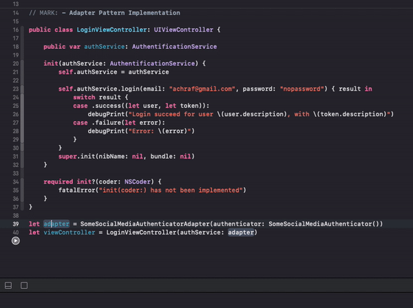

# DesginPatterns

## Table Of Contents
 - [Behavioral](#behavioral)
    * [Observer Pattern](#observer)

 - [Strcutural](#strcutural)
    * [Adapter Pattern](#adapter)

## Behavioral : 

### Observer Pattern

 - One object notifies other objects about its state change.
 - It is a one-to-many relationship.
 - When the state of one object changes, other object which are subscribed to it gets notified about the state change.
 - Observable protocol has three abstract methods : 
    * add(observerX) : to add an observer.
    * remove(observerX) : to remove a specific observer.
    * notify() : to notify all observers.

[Code example here](DesignPatters.playground/Sources/ObserverPattern.swift)

#### Implementation 

## Strcutural : 

### Adapter Pattern

 - Named also Wrapper.
 - Allows objects with incompatible interfaces to collaborate.
 - lets you create a middle-layer class that serves as a translator between your code and a legacy class, a 3rd-party class or any other class with a weird interface.
 - Do not add an additional behavior.

[Code example here](DesignPatters.playground/Sources/AdapterPattern.swift)

#### Implementation 

